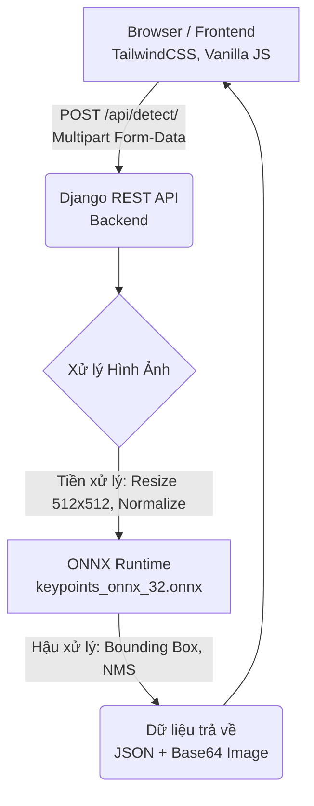

# ⚡ ZeroMatch – Phát Hiện Linh Kiện Điện Tử Trên Bảng Mạch

[](https://huggingface.co/spaces/TangSan003/detect_symbols)

> **ZeroMatch** là ứng dụng web tiên tiến sử dụng mô hình **Object Detection** trên nền tảng **ONNX Runtime** để nhận diện và định vị tự động các ký hiệu linh kiện điện tử trên sơ đồ mạch in (PCB / schematic). 
> 
> Tải ảnh lên, hệ thống sẽ ngay lập tức phát hiện, phân loại và đóng khung (bounding box) từng linh kiện với độ chính xác cao.

---

## 📋 Mục Lục

- [✨ Tính Năng Nổi Bật](#-tính-năng-nổi-bật)
- [🏗 Kiến Trúc Hệ Thống](#-kiến-trúc-hệ-thống)
- [🚀 Hướng Dẫn Cài Đặt (Docker)](#-hướng-dẫn-cài-đặt-docker)
- [⚙️ Cấu Hình Môi Trường](#️-cấu-hình-môi-trường)
- [📁 Cấu Trúc Dự Án](#-cấu-trúc-dự-án)
- [🔌 API Endpoint](#-api-endpoint)
- [🧩 Các Loại Linh Kiện Hỗ Trợ](#-các-loại-linh-kiện-hỗ-trợ)
- [🛠 Công Nghệ Sử Dụng (Tech Stack)](#-công-nghệ-sử-dụng-tech-stack)

---

## ✨ Tính Năng Nổi Bật

### 🔍 1. Quét Toàn Bộ Bảng Mạch
Tải lên ảnh **bảng mạch (pattern)**, hệ thống sẽ tự động dò quét **tất cả linh kiện** và hiển thị bounding box cùng điểm tin cậy (confidence score) trực quan ngay trên ảnh.

### 🎯 2. Nhận Diện Linh Kiện Đơn Lẻ
Tải lên ảnh **một linh kiện mẫu (drawing)**, AI sẽ phân tích và cho bạn biết chính xác đó là linh kiện gì (điện trở, tụ điện, diode,...) kèm theo độ tin cậy.

### 🔎 3. Tìm Kiếm Thông Minh (Match & Find)
Kết hợp sức mạnh từ cả 2 tính năng trên! Tải lên **bảng mạch** và **linh kiện cần tìm**, nhấn **Tìm kiếm**. Hệ thống sẽ lọc và chỉ đánh dấu các vị trí xuất hiện của linh kiện đó trên toàn bộ bảng mạch.
- Hỗ trợ chuyển đổi nhanh qua lại giữa **ALL** (hiển thị tất cả) và **Find** (chỉ hiển thị linh kiện đang tìm kiếm).

### 🖥 4. Giao Diện Premium, Thân Thiện
- **Bảng điều khiển (Sidebar)**: Hỗ trợ kéo thả ảnh tiện lợi, tùy chỉnh độ nhạy (confidence threshold).
- **Màn hình chính (Viewport)**: Render kết quả real-time, danh sách linh kiện thống kê trực quan chia làm 2 cột rõ ràng.
- **Thanh tiến trình (Progress Bar)**: Hiển thị trạng thái xử lý logic.
- **Mẫu thử nghiệm**: Tích hợp sẵn một vài ảnh mẫu để bạn có thể test ngay lập tức mà không cần tìm file.

---

## 🏗 Kiến Trúc Hệ Thống



### Luồng xử lý chi tiết (Inference Pipeline):
1. **Tiền xử lý**: Ảnh được resize về `512x512`, chuyển hệ màu RGB và normalize giá trị pixel về dải `[0, 1]`.
2. **Suy luận (Inference)**: ONNX model xuất ra 3 tensor cốt lõi: `bounding boxes`, `class labels`, và `confidence scores`.
3. **Phục hồi kích thước**: Bounding boxes được map trở lại kích thước ảnh gốc.
4. **Lọc nhiễu (NMS)**: Áp dụng thuật toán Non-Maximum Suppression (OpenCV DNN) với IoU `0.3` để loại bỏ các box trùng lặp.
5. **Đóng gói**: Vẽ box lên ảnh gốc, chuyển đổi thành Base64 và trả về cho client.

---

## 🚀 Hướng Dẫn Cài Đặt (Docker)

> [!IMPORTANT]  
> Bạn cần cài đặt [Docker](https://docs.docker.com/get-docker/) (≥ 20.10) và [Git LFS](https://git-lfs.com/) (để tải model `.onnx`).

### Môi Trường Phát Triển (Development) - Hot Reload
Sử dụng Docker Compose cho phép bạn thay đổi code và thấy kết quả ngay lập tức.

```bash
# 1. Clone repository
git clone https://huggingface.co/spaces/TangSan003/detect_symbols
cd detect_symbols

# 2. Tải model từ Git LFS
git lfs pull

# 3. Tạo/sửa file .env (xem mục Cấu hình)
nano .env

# 4. Khởi chạy
docker compose up --build
```
> Trình duyệt: **http://localhost:8000**

### Môi Trường Thực Tế (Production / Hugging Face Spaces)
Build trực tiếp bằng Dockerfile ở thư mục gốc (Root Dockerfile). Tối ưu hóa hiệu năng với Gunicorn và tự động migrate.

```bash
# 1. Build image
docker build -t zeromatch .

# 2. Chạy container
docker run -p 7860:7860 \
  -e DEBUG=False \
  -e SECRET_KEY=your-secure-secret-key \
  -e ALLOWED_HOSTS=* \
  zeromatch
```
> Trình duyệt: **http://localhost:7860**

---

## ⚙️ Cấu Hình Môi Trường

### Biến Môi Trường (`.env`)
Tạo file `.env` tại thư mục gốc của dự án:

| Biến | Ý Nghĩa | Giá trị Mặc Định |
|------|---------|-------------------|
| `DEBUG` | Kích hoạt chế độ debug Django | `True` |
| `SECRET_KEY` | Khóa bảo mật (Phải đổi khi deploy) | `django-insecure-...` |
| `ALLOWED_HOSTS` | Các tên miền được phép truy cập | `*` |

### Quản Lý Tệp Tĩnh (Static Files)
- Trong môi trường Production (`DEBUG=False`), hệ thống tự động sử dụng **WhiteNoise** để phân phối các tệp tĩnh (CSS, JS, hình ảnh) mà không cần cấu hình thêm Nginx.

### Vị Trí Lưu Trữ Mô Hình (ONNX Model)
File model `keypoints_onnx_32.onnx` (~230MB) được Git LFS theo dõi. Hệ thống sẽ tự tìm kiếm mô hình theo các đường dẫn ưu tiên:
1. `/models/keypoints_onnx_32.onnx` (Trong Docker Container)
2. `/app/trained_models_fs/keypoints_onnx_32.onnx`
3. `trained_models_fs/keypoints_onnx_32.onnx` (Local)

---

## 📁 Cấu Trúc Dự Án

```text
.
├── Dockerfile                  # Cấu hình build cho Production (Hugging Face Spaces)
├── docker-compose.yml          # Cấu hình môi trường Development
├── .env                        # File biến môi trường (cần tạo)
├── .gitattributes              # Theo dõi file lớn bằng Git LFS
│
└── backend/
    ├── manage.py               # Công cụ quản lý Django
    ├── requirements.txt        # Các thư viện Python cần thiết
    ├── onnx_inference.py       # Chứa logic xử lý mô hình ONNX & NMS
    │
    ├── trained_models_fs/      # Chứa file mô hình (.onnx)
    │
    ├── core/                   # Cấu hình hệ thống Django (settings, urls, wsgi)
    │
    ├── api/                    # Xử lý API RESTful (nhận diện, trả kết quả)
    │
    ├── templates/              # Giao diện HTML (base.html, index.html)
    │
    └── static/                 # Tài nguyên tĩnh (CSS, JS)
        └── js/
            ├── ui.js           # Điều khiển giao diện
            ├── upload.js       # Xử lý kéo/thả ảnh
            └── detection.js    # Tương tác API và render kết quả
```

---

## 🔌 API Endpoint

### `POST /api/detect/`

Nhận đầu vào là hình ảnh (Bảng mạch / Linh kiện) và trả về kết quả định vị.

**Content-Type:** `multipart/form-data`

| Trường (Field) | Loại | Bắt Buộc | Mô Tả |
|----------------|------|----------|-------|
| `pattern` | file | Không* | Hình ảnh tổng thể của bảng mạch |
| `drawing` | file | Không* | Hình mẫu của linh kiện cần tìm kiếm |
> *\* Ít nhất một trong hai trường phải có dữ liệu.*

**Cơ chế hoạt động:**
- Nếu chỉ gửi `pattern`: Trả về tất cả các linh kiện tìm thấy.
- Nếu chỉ gửi `drawing`: Nhận diện và trả về thông tin loại linh kiện đó (chỉ lấy kết quả tốt nhất).
- Nếu gửi cả 2: Lọc và trả về vị trí của loại linh kiện đó trên toàn bộ `pattern`.

<details>
<summary><b>📄 Xem mẫu kết quả JSON trả về</b></summary>

```json
{
  "success": true,
  "pattern_image": "data:image/png;base64,...",
  "pattern_image_all_boxes": "data:image/png;base64,...",
  "pattern_image_filtered": "data:image/png;base64,...",
  "pattern_targets": [
    { "label": "resistor", "score": 0.952, "box": [120, 45, 280, 110] }
  ],
  "pattern_total_found": 5,
  "drawing_image": "data:image/png;base64,...",
  "drawing_targets": [
    { "label": "resistor", "score": 0.987, "box": [10, 8, 150, 95] }
  ],
  "drawing_total_found": 1,
  "inference_time_ms": 320
}
```
</details>

---

## 🧩 Các Loại Linh Kiện Hỗ Trợ

Mô hình có khả năng nhận diện **55 loại linh kiện khác nhau**, bao gồm:

| Nhóm Phân Loại | Ký Hiệu Linh Kiện |
|----------------|-------------------|
| **Thụ Động** | `resistor`, `capacitor`, `capacitor_polarized`, `variable_capacitor`, `inductor`, `iron_core_inductor`, `variable_resistor`, `potentiometer`, `thermistor` |
| **Bán Dẫn** | `diode`, `led`, `schottky_zener_diode`, `transistor`, `npn_transistor`, `pnp_transistor`, `mosfet` |
| **Nguồn Cấp** | `voltage_source`, `current_source`, `ac_current`, `dependant_current`, `dependant_voltage`, `ground` |
| **Cổng Logic** | `and_gate`, `or_gate`, `not_gate`, `nand_gate`, `nor_gate`, `xor_gate`, `xnor_gate` |
| **Khuếch Đại** | `operational_amplifier`, `amplifier` |
| **Khác** | `switch`, `connector`, `transformer`, `fuse`, `antenna`, `motor`, `speaker`, `microphone`, v.v... |

---

## 🛠 Công Nghệ Sử Dụng (Tech Stack)

| Lớp (Layer) | Công Nghệ / Thư Viện | Phiên Bản |
|-------------|----------------------|-----------|
| **Frontend** | HTML5, TailwindCSS, Vanilla JS | Lớp mới nhất |
| **Backend** | Django, Django REST Framework | 4.2.9 / 3.14.0 |
| **Inference** | ONNX Runtime (CPU) | 1.17.1 |
| **Xử lý Ảnh** | OpenCV (Headless), NumPy, Pillow | 4.9.0 / 1.26.4 / 10.2.0 |
| **Server** | Gunicorn, WhiteNoise | 21.2.0 / 6.6.0 |

---
*Dự án được xây dựng và tối ưu nhằm phục vụ mục tiêu xử lý ảnh sơ đồ kỹ thuật.*
