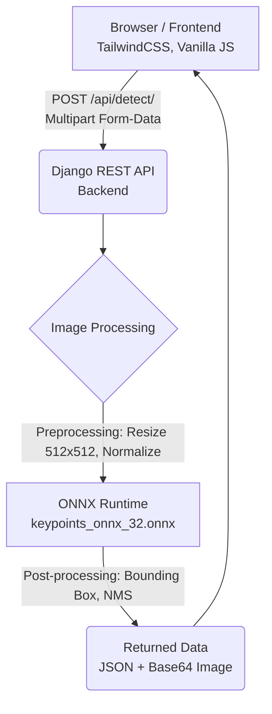

# ⚡ ZeroMatch – Electronic Component Detection on Circuit Boards

[](https://huggingface.co/spaces/TangSan003/detect_symbols)

> **ZeroMatch** is an advanced web application that utilizes an **Object Detection** model on the **ONNX Runtime** platform to automatically recognize and locate electronic component symbols on printed circuit boards (PCBs / schematics). 
> 
> Upload an image, and the system will immediately detect, classify, and draw bounding boxes around each component with high accuracy.

---

## 📋 Table of Contents

- [✨ Key Features](#-key-features)
- [🏗 System Architecture](#-system-architecture)
- [🚀 Installation Guide (Docker)](#-installation-guide-docker)
- [⚙️ Environment Configuration](#️-environment-configuration)
- [📁 Project Structure](#-project-structure)
- [🔌 API Endpoints](#-api-endpoints)
- [🧩 Supported Components](#-supported-components)
- [🛠 Tech Stack](#-tech-stack)

---

## ✨ Key Features

### 🔍 1. Full Circuit Board Scan
Upload an image of a **circuit board (pattern)**, and the system will automatically scan **all components** and display bounding boxes with confidence scores visually right on the image.

### 🎯 2. Single Component Recognition
Upload an image of **a single component sample (drawing)**, and the AI will analyze and tell you exactly what component it is (resistor, capacitor, diode,...) along with the confidence score.

### 🔎 3. Smart Search (Match & Find)
Combine the power of both features above! Upload both the **circuit board** and the **component you want to find**, then click **Search**. The system will filter and only highlight the locations where that specific component appears across the entire board.
- Supports quick toggling between **ALL** (display all) and **Find** (only display the searched component).

### 🖥 4. Premium & User-Friendly Interface
- **Sidebar**: Convenient drag-and-drop image support, adjustable confidence threshold.
- **Main Viewport**: Real-time result rendering, visual component statistics list clearly divided into 2 columns.
- **Progress Bar**: Displays the logical processing status.
- **Sample Images**: Built-in sample images so you can test right away without having to look for files.

---

## 🏗 System Architecture



### Detailed Inference Pipeline:
1. **Preprocessing**: The image is resized to `512x512`, converted to RGB color space, and pixel values are normalized to the `[0, 1]` range.
2. **Inference**: The ONNX model outputs 3 core tensors: `bounding boxes`, `class labels`, and `confidence scores`.
3. **Rescaling**: Bounding boxes are mapped back to the original image dimensions.
4. **Noise Filtering (NMS)**: Applies the Non-Maximum Suppression algorithm (OpenCV DNN) with an IoU of `0.3` to remove overlapping boxes.
5. **Packaging**: Draws boxes on the original image, converts it to Base64, and returns it to the client.

---

## 🚀 Installation Guide (Docker)

> [!IMPORTANT]  
> You need to install [Docker](https://docs.docker.com/get-docker/) (≥ 20.10) and [Git LFS](https://git-lfs.com/) (to download the `.onnx` model).

### Development Environment - Hot Reload
Using Docker Compose allows you to change the code and see the results immediately.

```bash
# 1. Clone the repository
git clone https://huggingface.co/spaces/TangSan003/detect_symbols
cd detect_symbols

# 2. Download the model using Git LFS
git lfs pull

# 3. Create/edit the .env file (see Configuration section)
nano .env

# 4. Start the application
docker compose up --build
```
> Browser: **http://localhost:8000**

### Production Environment (Hugging Face Spaces)
Build directly using the Dockerfile in the root directory. Optimizes performance with Gunicorn and runs migrations automatically.

```bash
# 1. Build the image
docker build -t zeromatch .

# 2. Run the container
docker run -p 7860:7860 \
  -e DEBUG=False \
  -e SECRET_KEY=your-secure-secret-key \
  -e ALLOWED_HOSTS=* \
  zeromatch
```
> Browser: **http://localhost:7860**

---

## ⚙️ Environment Configuration

### Environment Variables (`.env`)
Create a `.env` file in the project's root directory:

| Variable | Meaning | Default Value |
|----------|---------|---------------|
| `DEBUG` | Enables Django debug mode | `True` |
| `SECRET_KEY` | Security key (Must be changed when deploying) | `django-insecure-...` |
| `ALLOWED_HOSTS` | Allowed domain names for access | `*` |

### Static Files Management
- In the Production environment (`DEBUG=False`), the system automatically uses **WhiteNoise** to serve static files (CSS, JS, images) without requiring additional Nginx configuration.

### Model Storage Location (ONNX Model)
The model file `keypoints_onnx_32.onnx` (~230MB) is tracked by Git LFS. The system will automatically look for the model in these priority paths:
1. `/models/keypoints_onnx_32.onnx` (Inside the Docker Container)
2. `/app/trained_models_fs/keypoints_onnx_32.onnx`
3. `trained_models_fs/keypoints_onnx_32.onnx` (Local)

---

## 📁 Project Structure

```text
.
├── Dockerfile                  # Build config for Production (Hugging Face Spaces)
├── docker-compose.yml          # Development environment config
├── .env                        # Environment variables file (needs to be created)
├── .gitattributes              # Tracks large files using Git LFS
│
└── backend/
    ├── manage.py               # Django management utility
    ├── requirements.txt        # Required Python libraries
    ├── onnx_inference.py       # Contains logic for handling ONNX & NMS models
    │
    ├── trained_models_fs/      # Contains the model file (.onnx)
    │
    ├── core/                   # Django system settings (settings, urls, wsgi)
    │
    ├── api/                    # Handles RESTful APIs (detection, returning results)
    │
    ├── templates/              # HTML templates (base.html, index.html)
    │
    └── static/                 # Static resources (CSS, JS)
        └── js/
            ├── ui.js           # UI controls
            ├── upload.js       # Handles image drag & drop
            └── detection.js    # API interaction and result rendering
```

---

## 🔌 API Endpoints

### `POST /api/detect/`

Takes an image (Circuit Board / Component) as input and returns the localized results.

**Content-Type:** `multipart/form-data`

| Field | Type | Required | Description |
|-------|------|----------|-------------|
| `pattern` | file | No* | The overall image of the circuit board |
| `drawing` | file | No* | The sample image of the component to search for |
> *\* At least one of the two fields must contain data.*

**Operational Mechanism:**
- If only `pattern` is sent: Returns all found components.
- If only `drawing` is sent: Recognizes and returns information about that component type (only takes the best result).
- If both are sent: Filters and returns the locations of that component type across the entire `pattern`.

<details>
<summary><b>📄 View sample JSON response</b></summary>

```json
{
  "success": true,
  "pattern_image": "data:image/png;base64,...",
  "pattern_image_all_boxes": "data:image/png;base64,...",
  "pattern_image_filtered": "data:image/png;base64,...",
  "pattern_targets": [
    { "label": "resistor", "score": 0.952, "box": [120, 45, 280, 110] }
  ],
  "pattern_total_found": 5,
  "drawing_image": "data:image/png;base64,...",
  "drawing_targets": [
    { "label": "resistor", "score": 0.987, "box": [10, 8, 150, 95] }
  ],
  "drawing_total_found": 1,
  "inference_time_ms": 320
}
```
</details>

---

## 🧩 Supported Components

The model is capable of recognizing **55 different types of components**, including:

| Classification Group | Component Symbols |
|----------------------|-------------------|
| **Passive** | `resistor`, `capacitor`, `capacitor_polarized`, `variable_capacitor`, `inductor`, `iron_core_inductor`, `variable_resistor`, `potentiometer`, `thermistor` |
| **Semiconductor** | `diode`, `led`, `schottky_zener_diode`, `transistor`, `npn_transistor`, `pnp_transistor`, `mosfet` |
| **Power Source** | `voltage_source`, `current_source`, `ac_current`, `dependant_current`, `dependant_voltage`, `ground` |
| **Logic Gate** | `and_gate`, `or_gate`, `not_gate`, `nand_gate`, `nor_gate`, `xor_gate`, `xnor_gate` |
| **Amplifier** | `operational_amplifier`, `amplifier` |
| **Other** | `switch`, `connector`, `transformer`, `fuse`, `antenna`, `motor`, `speaker`, `microphone`, etc. |

---

## 🛠 Tech Stack

| Layer | Technology / Library | Version |
|-------|----------------------|---------|
| **Frontend** | HTML5, TailwindCSS, Vanilla JS | Latest |
| **Backend** | Django, Django REST Framework | 4.2.9 / 3.14.0 |
| **Inference** | ONNX Runtime (CPU) | 1.17.1 |
| **Image Processing** | OpenCV (Headless), NumPy, Pillow | 4.9.0 / 1.26.4 / 10.2.0 |
| **Server** | Gunicorn, WhiteNoise | 21.2.0 / 6.6.0 |

---
*The project was built and optimized to serve the goal of processing technical schematic images.*
